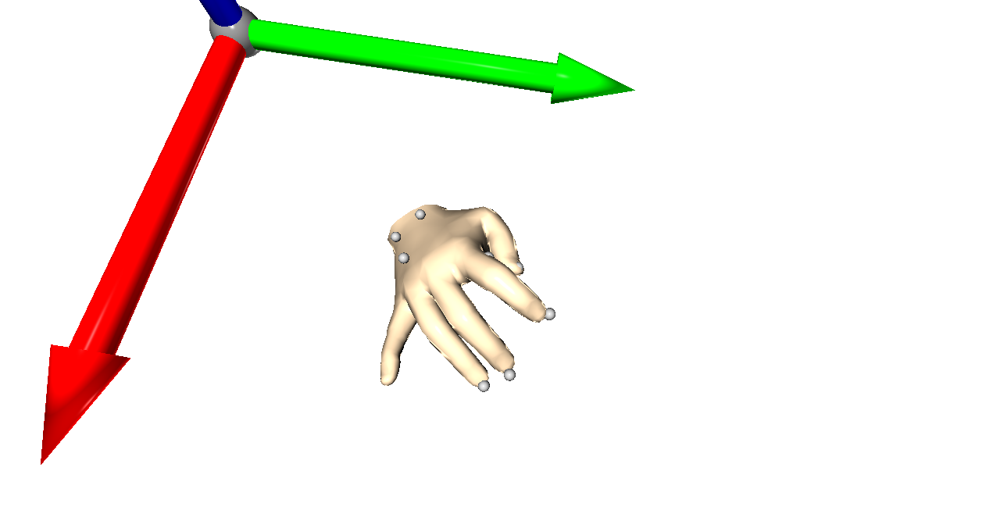
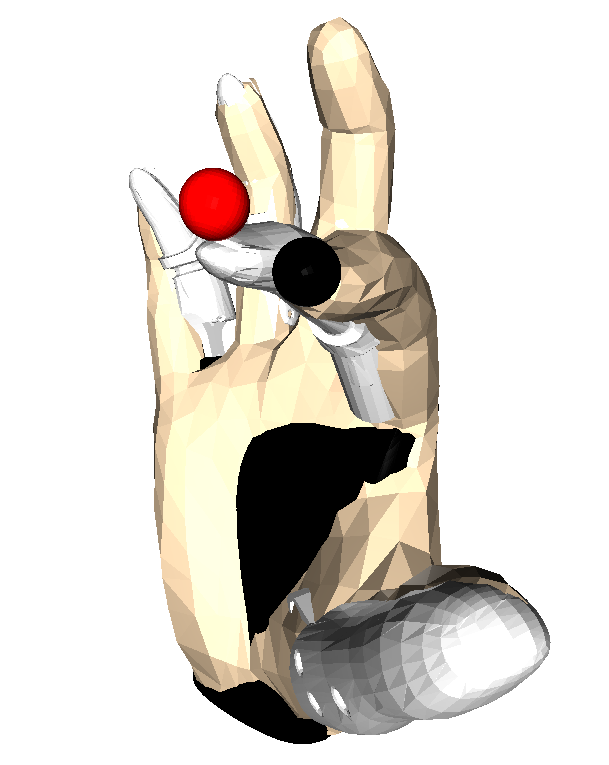
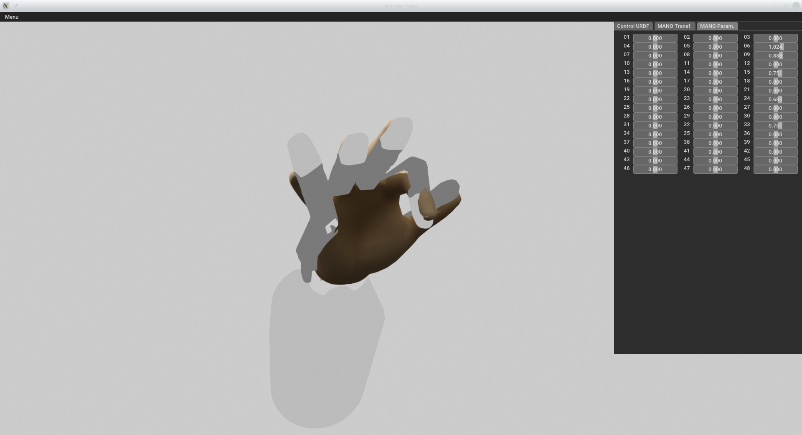

# Hand Embodiment


Embodiment mapping for robotic hands from human hand motions

## Installation

Install [mocap](https://git.hb.dfki.de/dfki-interaction/mocap) and then
install this library:

```bash
# note that you need access rights to the Mia URDF:
# https://github.com/aprilprojecteu/mia_hand_description
git clone git@git.hb.dfki.de:dfki-interaction/experimental/hand_embodiment.git --recursive
cd hand_embodiment
pip install -e .
```

## Idea

The general idea of this software package is to use the MANO hand model of
the mocap library to represent human hand configurations and then transfer
the state of the MANO model to robotic hands. This allows us to quickly
change the motion capture approach because we have an independent
representation of the hand's state. Furthermore, we can easily change
the target system because we just need to implement the mapping from
MANO to the target hand.

The currently implemented motion capture approaches are:
* marker-based motion capture with the Qualisys system

The currently implemented target systems are:
* Mia hand from Prensilia
* Dexterous Hand from Shadow

## Data

Some examples need motion capture data. Ask me about it.

## Examples



Motion capture data fitted to the MANO hand model.



Transfer of the MANO state to the Mia hand.



Interactive transfer of the MANO state to the Shadow hand.


Configuration of MANO parameters.

## Integrating a New Robotic Hand

Each target hand needs a configuration. These are typically stored in
`hand_embodiment.target_configurations`, but you can define them in your
own python script or module.

A configuration includes information about the kinematic setup of the hand:

* name of finger tip frames
* joints per finger
* base frame of the hand
* pose of base frame with respect to MANO base frame
* path to URDF
* virtual joints (e. g. coupling of joints)

The following scripts can be used to investigate a hand configuration:

* `bin/kinematics_diagram.py` - generates a kinematic diagram (graph) of the
  hand
* `bin/vis_extended_hand_model.py` - visualizes finger tip positions in the
  visual model of the hand, if you have to define additional finger tips this
  is a good tool to verify the result
* `bin/gui_robot_embodiment.py` - with this tool you can (1) find an
  appropriate pose of the hand in MANO's base and (2) interactively verify
  that the embodiment mapping finds appropriate solutions to mimic the MANO
  model

## Configuration for a New Subject

Each (human) subject has a different hand and we have to account for that in
the configuration of the record mapping, that is, we have to adapt the shape
of the MANO model. For this purpose there is the script `bin/gui_mano_shape.py`
with which you can load a Qualisys tsv file, visualize the hand markers,
and visualize and modify the shape and pose of the MANO mesh with respect to
the hand marker's frame at the back of the hand. You can create new
configuration files or modify an existing one. Make sure to save the edited
configuration with the button in the menu (left top). The MANO configuration
will later on be used when we recover the state of the hand from the motion
capture data.
