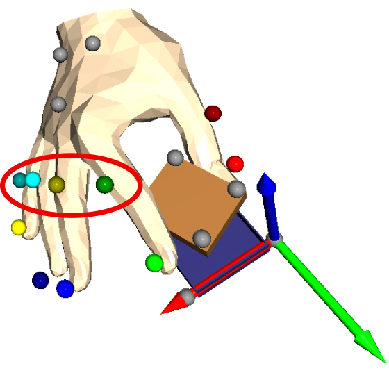
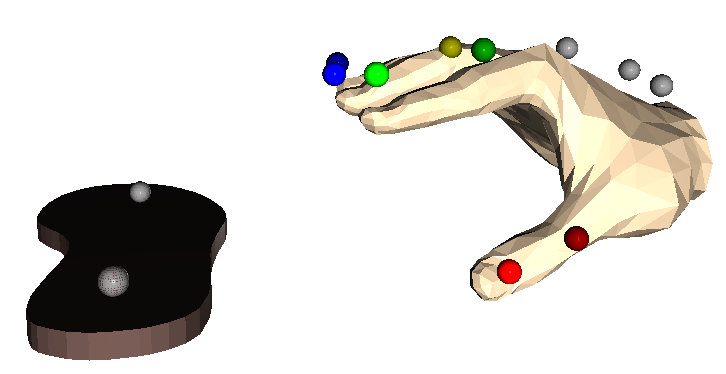
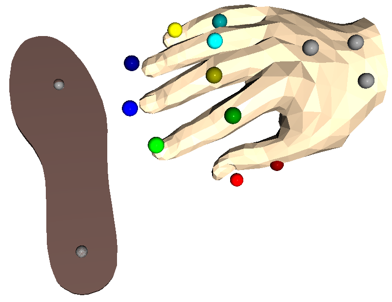
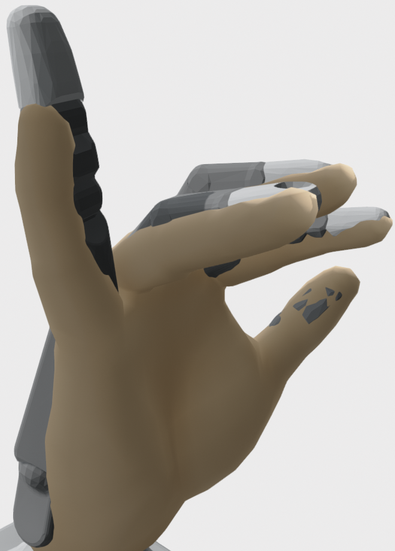
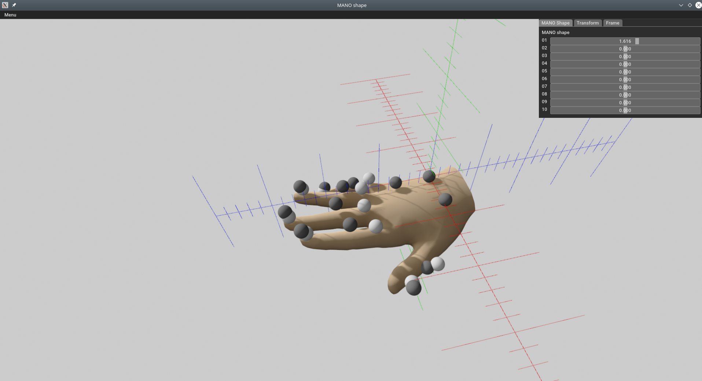

# Hand Embodiment


Embodiment mapping for robotic hands from human hand motions

## Idea

The general idea of this software package is to use the MANO hand model of
the mocap library to represent human hand configurations and then transfer
the state of the MANO model to robotic hands. This allows us to quickly
change the motion capture approach because we have an independent
representation of the hand's state. Furthermore, we can easily change
the target system because we just need to implement the mapping from
MANO to the target hand.

The currently implemented motion capture approaches are:
* marker-based motion capture with the Qualisys system

The currently implemented target systems are:
* Mia hand from Prensilia
* Dexterous Hand from Shadow

## Installation

### Install Hand Embodiment

```bash
git clone git@git.hb.dfki.de:dfki-interaction/experimental/hand_embodiment.git
cd hand_embodiment
# prepare MANO model, see subfolder hand_embodiment/model/mano for details
pip install -e .
```

### Optional Dependency

The library [mocap](https://git.hb.dfki.de/dfki-interaction/mocap) is only
available for members of the DFKI RIC. It is used to load motion capture data.

### Data

Some examples need motion capture data. Ask me about it. Unfortunately,
we cannot release the data publicly.

## Examples

### Motion Capture Data Fitted to MANO

<table>
<tr>
<td></td>
<td></td>
</tr>
<tr>
<td></td>
<td></td>
</tr>
<tr>
<td></td>
<td></td>
</tr>
<tr>
<td></td>
<td></td>
</tr>
<tr>
<td></td>
<td></td>
</tr>
</table>

### Interactive Transfer of MANO State to Robotic Hands

<table>
<tr>
<td></td>
<td></td>
</tr>
<tr>
<td></td>
<td></td>
</tr>
<tr>
<td></td>
<td></td>
</tr>
<tr>
<td></td>
<td></td>
</tr>
</table>

### Configuration of MANO Parameters



## Integrating a New Robotic Hand

Each target hand needs a configuration. These are typically stored in
`hand_embodiment.target_configurations`, but you can define them in your
own python script or module.

A configuration includes information about the kinematic setup of the hand:

* name of finger tip frames
* joints per finger
* base frame of the hand
* pose of base frame with respect to MANO base frame
* path to URDF
* virtual joints (e. g. coupling of joints)

The following scripts can be used to investigate a hand configuration:

* `bin/kinematics_diagram.py` - generates a kinematic diagram (graph) of the
  hand
* `bin/vis_extended_hand_model.py` - visualizes finger tip positions in the
  visual model of the hand, if you have to define additional finger tips this
  is a good tool to verify the result
* `bin/gui_robot_embodiment.py` - with this tool you can (1) find an
  appropriate pose of the hand in MANO's base and (2) interactively verify
  that the embodiment mapping finds appropriate solutions to mimic the MANO
  model

## Configuration for a New Subject

Each (human) subject has a different hand and we have to account for that in
the configuration of the record mapping, that is, we have to adapt the shape
of the MANO model. For this purpose there is the script `bin/gui_mano_shape.py`
with which you can load a Qualisys tsv file, visualize the hand markers,
and visualize and modify the shape and pose of the MANO mesh with respect to
the hand marker's frame at the back of the hand. You can create new
configuration files or modify an existing one. Make sure to save the edited
configuration with the button in the menu (left top). The MANO configuration
will later on be used when we recover the state of the hand from the motion
capture data.

## Segmentation of Motion Capture Data

Motion capture recordings typically contain a sequence of multiple movements,
often multiple demonstrations of the same movement. In order to use individual
behavioral building blocks subsequently, these recordings have to be segmented.
This can be done manually or automatically.

### Automatic Segmentation

Automatic segmentation is based on velocity-based multiple changepoint
inference (vMCI,
[Senger et al. (2014)](https://www.dfki.de/fileadmin/user_upload/import/7319_140411_Velocity-Based_Multiple_Change-point_Inference_for_Unsupervised_Segmentation_of_Human_Movement_Behavior_ICPR_Senger.pdf)).
In order to apply vMCI, the following dependencies have to be installed:

* vMCI: https://git.hb.dfki.de/dfki-interaction/vMCI_segmentation
* segmentation library: https://git.hb.dfki.de/dfki-interaction/segmentation_library

The script `bin/segment_mocap_recording.py` can be used to apply vMCI to a
Qualisys motion capture file in TSV format. A corresponding metadata file in
JSON format will be created. Segments are not labeled yet because this has to
be done manually with the same tool with which we can also perform manual
segmentation.

### Manual Segmentation and Annotation

The trajectory labeling GUI
(https://git.hb.dfki.de/dfki-interaction/trajectory_labeling) can be used to
segment motion capture data and annotate segments manually. The following
image shows the GUI.


At the bottom, the velocity profiles of index tip and hand top markers are
visible. Segments with the label `close` are marked with green background
color. On the left side, there is a list of annotated segments. In the middle
we can see a 3D view of markers and on the right side we see the segment and
annotation editor.
