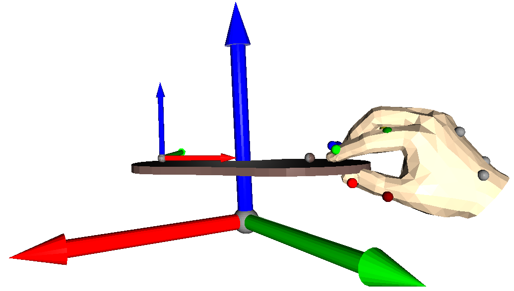
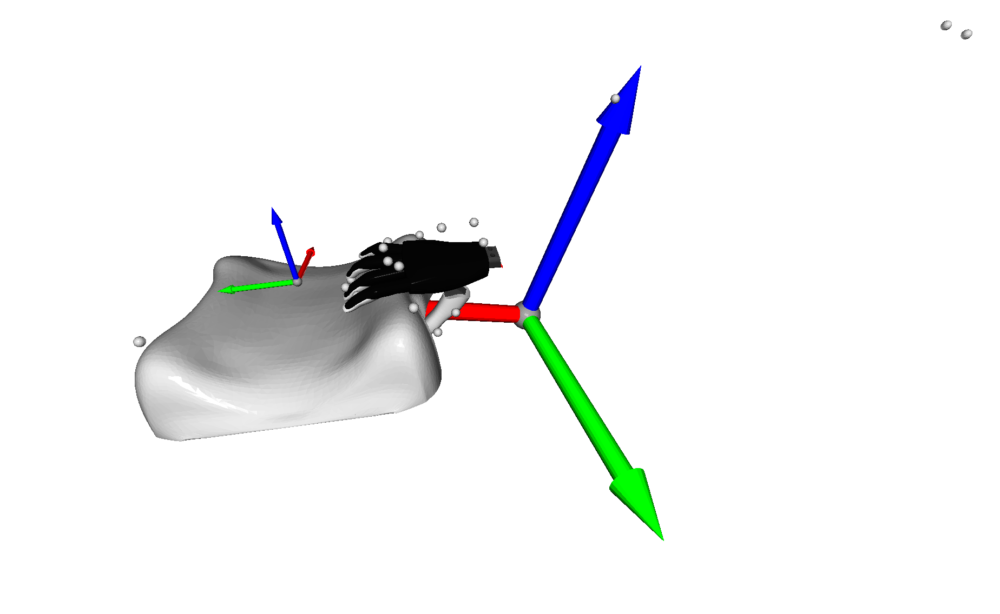
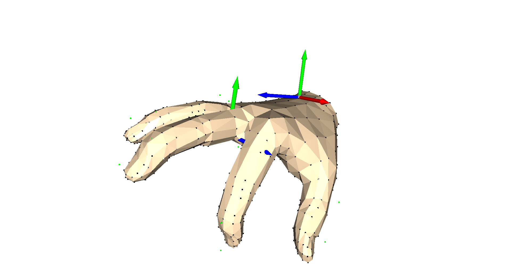

# Scripts for Hand Embodiment

## Visualize Record Mapping



Script: [vis_markers_to_mano_trajectory.py](vis_markers_to_mano_trajectory.py)

Example calls:
```bash
python bin/vis_markers_to_mano_trajectory.py --demo-file data/Qualisys_pnp/20151005_r_AV82_PickAndPlace_BesMan_labeled_02.tsv --mocap-config examples/config/markers/20151005_besman.yaml --mano-config examples/config/mano/20151005_besman.yaml
python bin/vis_markers_to_mano_trajectory.py --demo-file data/QualisysAprilTest/april_test_005.tsv
python bin/vis_markers_to_mano_trajectory.py --demo-file data/20210610_april/Measurement2.tsv --mocap-config examples/config/markers/20210610_april.yaml --mano-config examples/config/mano/20210610_april.yaml
python bin/vis_markers_to_mano_trajectory.py --demo-file data/20210616_april/Measurement16.tsv --mocap-config examples/config/markers/20210616_april.yaml --mano-config examples/config/mano/20210610_april.yaml --insole
python bin/vis_markers_to_mano_trajectory.py --demo-file data/20210701_april/Measurement30.tsv --mocap-config examples/config/markers/20210616_april.yaml --mano-config examples/config/mano/20210610_april.yaml --insole
```

Grasp insole:
```bash
python bin/vis_markers_to_mano_trajectory.py --demo-file data/20210819_april/20210819_r_WK37_insole_set0.tsv --mocap-config examples/config/markers/20210819_april.yaml --mano-config examples/config/mano/20210610_april.yaml  --record-mapping-config examples/config/record_mapping/20211105_april.yaml --insole
python bin/vis_markers_to_mano_trajectory.py --demo-file data/20211119_april/20211119_r_WK37_insole_set2.tsv --mocap-config examples/config/markers/20211119_april.yaml --mano-config examples/config/mano/20211105_april.yaml --record-mapping-config examples/config/record_mapping/20211105_april.yaml --insole --interpolate-missing-markers
```

Insert insole:
```bash
python bin/vis_markers_to_mano_trajectory.py --demo-file data/20211126_april_insole/20211126_r_WK37_insole_insert_set0.tsv --mocap-config examples/config/markers/20211126_april_insole.yaml --mano-config examples/config/mano/20211105_april.yaml
```

Grasp small pillow:
```bash
python bin/vis_markers_to_mano_trajectory.py --demo-file data/20210826_april/20210826_r_WK37_small_pillow_set0.tsv --mocap-config examples/config/markers/20210826_april.yaml --mano-config examples/config/mano/20210610_april.yaml --record-mapping-config examples/config/record_mapping/20211105_april.yaml --pillow
```

Grasp big pillow:
```bash
python bin/vis_markers_to_mano_trajectory.py --demo-file data/20211126_april_pillow/20211126_r_WK37_big_pillow_set0.tsv --mocap-config examples/config/markers/20211126_april_pillow.yaml --mano-config examples/config/mano/20211105_april.yaml
```

Grasp and assemble electronic components:
```bash
python bin/vis_markers_to_mano_trajectory.py --demo-file data/20211105_april/20211105_r_WK37_electronic_set0.tsv --mocap-config examples/config/markers/20211105_april.yaml --mano-config examples/config/mano/20210610_april.yaml --electronic
python bin/vis_markers_to_mano_trajectory.py --demo-file data/20211105_april/20211105_r_WK37_electronic_set0.tsv --mocap-config examples/config/markers/20211105_april.yaml --mano-config examples/config/mano/20211105_april.yaml --record-mapping-config examples/config/record_mapping/20211105_april.yaml --electronic
```

Flip pages of a passport:
```bash
python bin/vis_markers_to_mano_trajectory.py --demo-file data/20211112_april/20211112_r_WK37_passport_set0.tsv --mocap-config examples/config/markers/20211112_april.yaml --mano-config examples/config/mano/20211105_april.yaml --record-mapping-config examples/config/record_mapping/20211105_april.yaml --passport
```

Insert passport:
```bash
python bin/vis_markers_to_mano_trajectory.py --demo-file data/20211217_april/20211217_r_WK37_passport_box_set0.tsv --mocap-config examples/config/markers/20211217_april.yaml --mano-config examples/config/mano/20211105_april.yaml --passport-closed
```

Grasp insole (pinch and lateral grasps)
```bash
python bin/vis_markers_to_mano_trajectory.py --demo-file data/20220328_april/20220328_r_WK37_insole_lateral_back_set0.tsv --mocap-config examples/config/markers/20220328_april.yaml --mano-config examples/config/mano/20211105_april.yaml  --record-mapping-config examples/config/record_mapping/20211105_april.yaml --insole
```

## Visualize Record and Embodiment Mapping



### Trajectory

Script: [vis_markers_to_robot.py](vis_markers_to_robot.py)

Example calls:
```bash
python bin/vis_markers_to_robot.py shadow --demo-file test/data/recording.tsv --mocap-config examples/config/markers/20210826_april.yaml --mano-config examples/config/mano/20210610_april.yaml --record-mapping-config examples/config/record_mapping/20211105_april.yaml --pillow --show-mano
python bin/vis_markers_to_robot.py mia --demo-file test/data/recording.tsv --mocap-config examples/config/markers/20210826_april.yaml --mano-config examples/config/mano/20210610_april.yaml --record-mapping-config examples/config/record_mapping/20211105_april.yaml --pillow --mia-thumb-adducted --show-mano
python bin/vis_markers_to_robot.py mia --demo-file data/Qualisys_pnp/20151005_r_AV82_PickAndPlace_BesMan_labeled_02.tsv --mocap-config examples/config/markers/20151005_besman.yaml --mano-config examples/config/mano/20151005_besman.yaml
python bin/vis_markers_to_robot.py mia --demo-file data/QualisysAprilTest/april_test_005.tsv
python bin/vis_markers_to_robot.py mia --demo-file data/20210610_april/Measurement2.tsv --mocap-config examples/config/markers/20210610_april.yaml --mano-config examples/config/mano/20210610_april.yaml --mia-thumb-adducted
python bin/vis_markers_to_robot.py mia --mocap-config examples/config/markers/20210616_april.yaml --mano-config examples/config/mano/20210616_april.yaml --show-mano --demo-file data/20210616_april/Measurement24.tsv --mia-thumb-adducted
python bin/vis_markers_to_robot.py mia --mocap-config examples/config/markers/20210616_april.yaml --mano-config examples/config/mano/20210616_april.yaml --demo-file data/20210701_april/Measurement30.tsv --insole --mia-thumb-adducted
python bin/vis_markers_to_robot.py mia --mocap-config examples/config/markers/20210819_april.yaml --mano-config examples/config/mano/20210616_april.yaml --demo-file data/20210819_april/20210819_r_WK37_insole_set0.tsv --insole --show-mano --mia-thumb-adducted
python bin/vis_markers_to_robot.py shadow --mocap-config examples/config/markers/20211105_april.yaml --mano-config examples/config/mano/20210616_april.yaml --demo-file data/20210819_april/20210819_r_WK37_insole_set0.tsv --insole --show-mano
python bin/vis_markers_to_robot.py mia --mocap-config examples/config/markers/20210826_april.yaml --mano-config examples/config/mano/20210610_april.yaml --demo-file data/20210826_april/20210826_r_WK37_small_pillow_set0.tsv --record-mapping-config examples/config/record_mapping/20211105_april.yaml --show-mano --mia-thumb-adducted --pillow
python bin/vis_markers_to_robot.py shadow --mocap-config examples/config/markers/20211105_april.yaml --mano-config examples/config/mano/20210610_april.yaml --record-mapping-config examples/config/record_mapping/20211105_april.yaml --demo-file data/20211105_april/20211105_r_WK37_electronic_set0.tsv --show-mano --electronic
python bin/vis_markers_to_robot.py shadow --mocap-config examples/config/markers/20211112_april.yaml --mano-config examples/config/mano/20210610_april.yaml --record-mapping-config examples/config/record_mapping/20211105_april.yaml --demo-file data/20211112_april/20211112_r_WK37_passport_set0.tsv --show-mano --passport
```

Grasp insole:
```bash
python bin/vis_markers_to_robot.py mia --demo-file data/20210819_april/20210819_r_WK37_insole_set0.tsv --mocap-config examples/config/markers/20210819_april.yaml --mano-config examples/config/mano/20210616_april.yaml --insole --mia-thumb-adducted --show-mano
```

Insert insole:
```bash
python bin/vis_markers_to_robot.py shadow --demo-file data/20211126_april_insole/20211126_r_WK37_insole_insert_set0.tsv --mocap-config examples/config/markers/20211126_april_insole.yaml --mano-config examples/config/mano/20211105_april.yaml
```

Grasp small pillow:
```bash
python bin/vis_markers_to_robot.py mia --demo-file data/20210826_april/20210826_r_WK37_small_pillow_set0.tsv --mocap-config examples/config/markers/20210826_april.yaml --mano-config examples/config/mano/20210610_april.yaml --record-mapping-config examples/config/record_mapping/20211105_april.yaml --pillow --mia-thumb-adducted
```

Grasp big pillow:
```bash
python bin/vis_markers_to_robot.py mia --demo-file data/20211126_april_pillow/20211126_r_WK37_big_pillow_set0.tsv --mocap-config examples/config/markers/20211126_april_pillow.yaml --mano-config examples/config/mano/20211105_april.yaml --mia-thumb-adducted
```

Grasp and assemble electronic components:
```bash
python bin/vis_markers_to_robot.py shadow --demo-file data/20211105_april/20211105_r_WK37_electronic_set0.tsv --mocap-config examples/config/markers/20211105_april.yaml --mano-config examples/config/mano/20211105_april.yaml --record-mapping-config examples/config/record_mapping/20211105_april.yaml --electronic
```

Flip pages of a passport:
```bash
python bin/vis_markers_to_robot.py shadow --demo-file data/20211112_april/20211112_r_WK37_passport_set0.tsv --mocap-config examples/config/markers/20211112_april.yaml --mano-config examples/config/mano/20211105_april.yaml --record-mapping-config examples/config/record_mapping/20211105_april.yaml --passport
```

Insert passport:
```bash
python bin/vis_markers_to_robot.py mia --demo-file data/20211217_april/20211217_r_WK37_passport_box_set2.tsv --mocap-config examples/config/markers/20211217_april.yaml --mano-config examples/config/mano/20211105_april.yaml --passport-closed --mia-thumb-adducted
```

### Segment

Script: [vis_segment_markers_to_robot.py](vis_segment_markers_to_robot.py)

Example calls:
```bash
python bin/vis_segment_markers_to_robot.py mia close --mocap-config examples/config/markers/20210616_april.yaml --mano-config examples/config/mano/20210616_april.yaml --demo-file data/20210616_april/metadata/Measurement24.json --segment 0
python bin/vis_segment_markers_to_robot.py mia close --mocap-config examples/config/markers/20210616_april.yaml --mano-config examples/config/mano/20210701_april.yaml --mia-thumb-adducted --demo-file data/20210701_april/Measurement30.json --segment 0 --insole
python bin/vis_segment_markers_to_robot.py mia close --mocap-config examples/config/markers/20210819_april.yaml --mano-config examples/config/mano/20210701_april.yaml --mia-thumb-adducted --demo-file data/20210819_april/20210819_r_WK37_insole_set0.json --segment 0 --insole
python bin/vis_segment_markers_to_robot.py mia close --mocap-config examples/config/markers/20210826_april.yaml --mano-config examples/config/mano/20210701_april.yaml --mia-thumb-adducted --demo-file data/20210826_april/20210826_r_WK37_small_pillow_set0.json --segment 0 --pillow
python bin/vis_segment_markers_to_robot.py shadow flip --mocap-config examples/config/markers/20211112_april.yaml --mano-config examples/config/mano/20211105_april.yaml --demo-file data/20211112_april/20211112_r_WK37_passport_set0.json --passport --show-mano --segment 0
python bin/vis_segment_markers_to_robot.py mia close --mocap-config examples/config/markers/20211119_april.yaml --mano-config examples/config/mano/20211105_april.yaml --mia-thumb-adducted --demo-file data/20211119_april/20211119_r_WK37_insole_set0.json --segment 0 --insole
python bin/vis_segment_markers_to_robot.py mia insert --mocap-config examples/config/markers/20211217_april.yaml --mano-config examples/config/mano/20211105_april.yaml --mia-thumb-adducted --show-mano --demo-file data/20211217_april/20211217_r_WK37_passport_box_set0.json --segment 0 --passport-closed
python bin/vis_segment_markers_to_robot.py mia close --mocap-config examples/config/markers/20220328_april.yaml --mano-config examples/config/mano/20211105_april.yaml --show-mano --demo-file data/20220328_april/20220328_r_WK37_insole_lateral_front_set0.json --segment 0 --insole
python bin/vis_segment_markers_to_robot.py mia close --mocap-config examples/config/markers/20220328_april.yaml --mano-config examples/config/mano/20211105_april.yaml --show-mano --demo-file data/20220328_april/20220328_r_WK37_insole_pinch_front_set0.json --segment 0 --insole --mia-thumb-adducted
```

## Convert Motion Capture Data to Robotic Hand Trajectories

### Full Trajectory

Script: [convert_hand_trajectory.py](convert_hand_trajectory.py)

Example calls:
```bash
python bin/convert_hand_trajectory.py mia --mia-thumb-adducted --demo-file data/QualisysAprilTest/april_test_009.tsv --output trajectory_009.csv
```

### Segments

Script: [convert_segments.py](convert_segments.py)

Example calls:
```bash
python bin/convert_segments.py mia close --mia-thumb-adducted --mocap-config examples/config/markers/20210616_april.yaml --demo-file data/20210616_april/metadata/Measurement16.json --output dataset_16_segment_%d.csv
python bin/convert_segments.py mia close --mia-thumb-adducted --mocap-config examples/config/markers/20210616_april.yaml --demo-file data/20210616_april/metadata/Measurement23.json --output dataset_23_segment_%d.csv
python bin/convert_segments.py mia close --mia-thumb-adducted --mocap-config examples/config/markers/20210616_april.yaml --demo-file data/20210616_april/metadata/Measurement24.json --output dataset_24_segment_%d.csv
python bin/convert_segments.py mia close --mia-thumb-adducted --mocap-config examples/config/markers/20210616_april.yaml --demo-file data/20210701_april/Measurement30.json --output dataset_30_segment_%d.csv --insole-hack
python bin/convert_segments.py mia close --mia-thumb-adducted --mocap-config examples/config/markers/20210819_april.yaml --demo-file data/20210819_april/20210819_r_WK37_insole_set0.json --output 20210819_r_WK37_insole_set0_%d.csv --insole-hack
python bin/convert_segments.py mia close --mia-thumb-adducted --mocap-config examples/config/markers/20210826_april.yaml --demo-file data/20210826_april/20210826_r_WK37_small_pillow_set0.json --output 20210826_r_WK37_small_pillow_set0_%d.csv --pillow-hack --measure-time
```

Grasp insole:
```bash
python bin/convert_segments.py mia close --mia-thumb-adducted --mocap-config examples/config/markers/20210819_april.yaml --demo-file data/20210819_april/2021*_r_WK37_insole_set*.json --output 2021_r_WK37_insole_%d.csv --insole-hack --measure-time
python bin/convert_segments.py shadow close --mocap-config examples/config/markers/20210819_april.yaml --mano-config examples/config/mano/20211105_april.yaml --demo-file data/20210819_april/2021*_r_WK37_insole_set*.json --output 2021_r_WK37_insole_%d.csv --insole-hack --measure-time
```

Grasp small pillow:
```bash
python bin/convert_segments.py mia close --mia-thumb-adducted --mocap-config examples/config/markers/20210826_april.yaml --demo-file data/20210826_april/2021*_r_WK37_small_pillow_set*.json --output 2021_r_WK37_small_pillow_%d.csv --pillow-hack --measure-time
python bin/convert_segments.py shadow close --mocap-config examples/config/markers/20210826_april.yaml --mano-config examples/config/mano/20211105_april.yaml --demo-file data/20210826_april/2021*_r_WK37_small_pillow_set*.json --output 2021_r_WK37_small_pillow_%d.csv --pillow-hack --measure-time
```

Grasp electronic component:
```bash
python bin/convert_segments.py mia grasp --mia-thumb-adducted --mocap-config examples/config/markers/20211105_april.yaml --demo-file data/20211105_april/2021*_r_WK37_electronic_set*.json --output 2021_r_WK37_electronic_%d.csv --electronic-object-hack --measure-time --interpolate-missing-markers
python bin/convert_segments.py shadow grasp --mocap-config examples/config/markers/20211105_april.yaml --demo-file data/20211105_april/2021*_r_WK37_electronic_set*.json --output 2021_r_WK37_electronic_%d.csv --electronic-object-hack --measure-time --interpolate-missing-markers
```

Assembly of electronic components:
```bash
python bin/convert_segments.py mia insert --mia-thumb-adducted --mocap-config examples/config/markers/20211105_april.yaml --demo-file data/20211105_april/2021*_r_WK37_electronic_set*.json --output 2021_r_WK37_electronic_insert_%d.csv --electronic-target-hack --measure-time --interpolate-missing-markers
python bin/convert_segments.py shadow insert --mocap-config examples/config/markers/20211105_april.yaml --demo-file data/20211105_april/2021*_r_WK37_electronic_set*.json --output 2021_r_WK37_electronic_insert_%d.csv --electronic-target-hack --measure-time --interpolate-missing-markers
```

Flip pages of a passport:
```bash
python bin/convert_segments.py mia flip --mia-thumb-adducted --mocap-config examples/config/markers/20211112_april.yaml --demo-file data/20211112_april/20211112_r_WK37_passport_set*.json --output 2021_r_WK37_flip_passport_%d.csv --passport-hack --measure-time --interpolate-missing-markers
python bin/convert_segments.py shadow flip --mocap-config examples/config/markers/20211112_april.yaml --demo-file data/20211112_april/20211112_r_WK37_passport_set*.json --output 2021_r_WK37_flip_passport_%d.csv --passport-hack --measure-time --interpolate-missing-markers
```

Grasp big pillow:
```bash
python bin/convert_segments.py mia grasp --mia-thumb-adducted --mocap-config examples/config/markers/20211126_april_pillow.yaml --demo-file data/20211126_april_pillow/20211126_r_WK37_big_pillow_set*.json --output 2021_r_WK37_big_pillow_%d.csv --measure-time --interpolate-missing-markers
python bin/convert_segments.py shadow grasp --mocap-config examples/config/markers/20211126_april_pillow.yaml --demo-file data/20211126_april_pillow/20211126_r_WK37_big_pillow_set*.json --output 2021_r_WK37_big_pillow_%d.csv --measure-time --interpolate-missing-markers
```

Insert insole:
```bash
python bin/convert_segments.py mia insert --mocap-config examples/config/markers/20211126_april_insole.yaml --demo-file data/20211126_april_insole/20211126_r_WK37_insert_insole_set*.json --output 2021_r_WK37_insert_insole_%d.csv --measure-time --interpolate-missing-markers
python bin/convert_segments.py shadow insert --mocap-config examples/config/markers/20211126_april_insole.yaml --demo-file data/20211126_april_insole/20211126_r_WK37_insert_insole_set*.json --output 2021_r_WK37_insert_insole_%d.csv --measure-time --interpolate-missing-markers
```

Insert passport in a box:
```bash
python bin/convert_segments.py mia insert --mia-thumb-adducted --mocap-config examples/config/markers/20211217_april.yaml --demo-file data/20211217_april/20211217_r_WK37_passport_box_set*.json --output 2021_r_WK37_insert_passport_%d.csv --passport-box-hack --measure-time --interpolate-missing-markers
python bin/convert_segments.py shadow insert --mocap-config examples/config/markers/20211217_april.yaml --demo-file data/20211217_april/20211217_r_WK37_passport_box_set*.json --output 2021_r_WK37_insert_passport_%d.csv --passport-box-hack --measure-time --interpolate-missing-markers
```

Insole dataset with labels for grasp point (front, middle, back) and grasp type (spherical, pinch, lateral):
```bash
python bin/convert_segments.py mia grasp_spherical_insole_middle --demo-files data/20210819_april/*.json data/20211119_april/*.json data/20220328_april/*.json --label-field l2 --mocap-config examples/config/markers/20211119_april.yaml --output 2022_r_WK37_insole_spherical_middle_%d.csv --insole-hack --measure-time
python bin/convert_segments.py mia grasp_spherical_insole_front --demo-files data/20210819_april/*.json data/20211119_april/*.json data/20220328_april/*.json --label-field l2 --mocap-config examples/config/markers/20210819_april.yaml --output 2022_r_WK37_insole_spherical_front_%d.csv --insole-hack --measure-time
python bin/convert_segments.py mia grasp_spherical_insole_back --demo-files data/20210819_april/*.json data/20211119_april/*.json data/20220328_april/*.json --label-field l2 --mocap-config examples/config/markers/20210819_april.yaml --output 2022_r_WK37_insole_spherical_back_%d.csv --insole-hack --measure-time
python bin/convert_segments.py mia grasp_pinch_insole_back --demo-files data/20210819_april/*.json data/20211119_april/*.json data/20220328_april/*.json --label-field l2 --mia-thumb-adducted --mocap-config examples/config/markers/20220328_april.yaml --output 2022_r_WK37_insole_pinch_back_%d.csv --insole-hack --measure-time
python bin/convert_segments.py mia grasp_pinch_insole_front --demo-files data/20210819_april/*.json data/20211119_april/*.json data/20220328_april/*.json --label-field l2 --mia-thumb-adducted --mocap-config examples/config/markers/20220328_april.yaml --output 2022_r_WK37_insole_pinch_front_%d.csv --insole-hack --measure-time
python bin/convert_segments.py mia grasp_lateral_insole_back --demo-files data/20210819_april/*.json data/20211119_april/*.json data/20220328_april/*.json --label-field l2 --mocap-config examples/config/markers/20220328_april.yaml --output 2022_r_WK37_insole_lateral_back_%d.csv --insole-hack --measure-time
python bin/convert_segments.py mia grasp_lateral_insole_front --demo-files data/20210819_april/*.json data/20211119_april/*.json data/20220328_april/*.json --label-field l2 --mocap-config examples/config/markers/20220328_april.yaml --output 2022_r_WK37_insole_lateral_front_%d.csv --insole-hack --measure-time
```

## Visualize MANO



Script: [vis_mano.py](vis_mano.py)

Example call:
```bash
python bin/vis_mano.py --config-filename examples/config/april_test_mano2.yaml --show-tips --show-mesh --show-transforms
```

## Visualize Extended Robotic Hand Model


Script: [vis_extended_hand_model.py](vis_extended_hand_model.py)

Example calls:
```bash
python bin/vis_extended_hand_model.py mia
python bin/vis_extended_hand_model.py --hide-visuals --show-focus --show-contact-vertices shadow_hand
python bin/vis_extended_hand_model.py --hide-visuals --show-contact-vertices --write-vertex-indices barrett
python bin/vis_extended_hand_model.py --hide-visuals --show-contact-vertices --highlight-stored-vertices barrett
```
