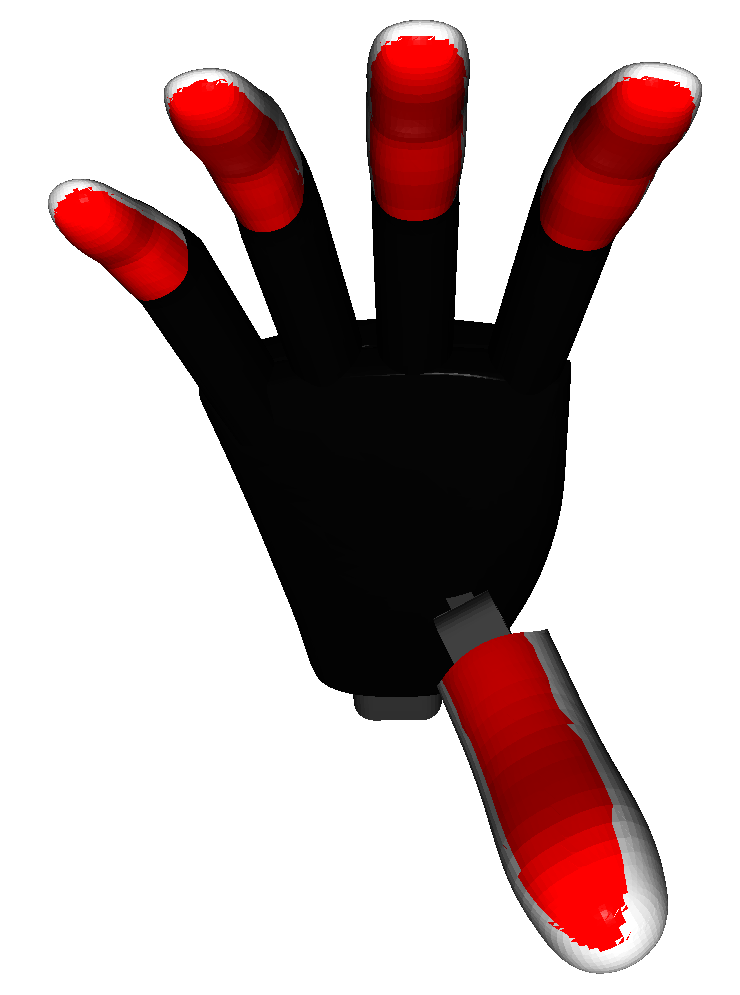
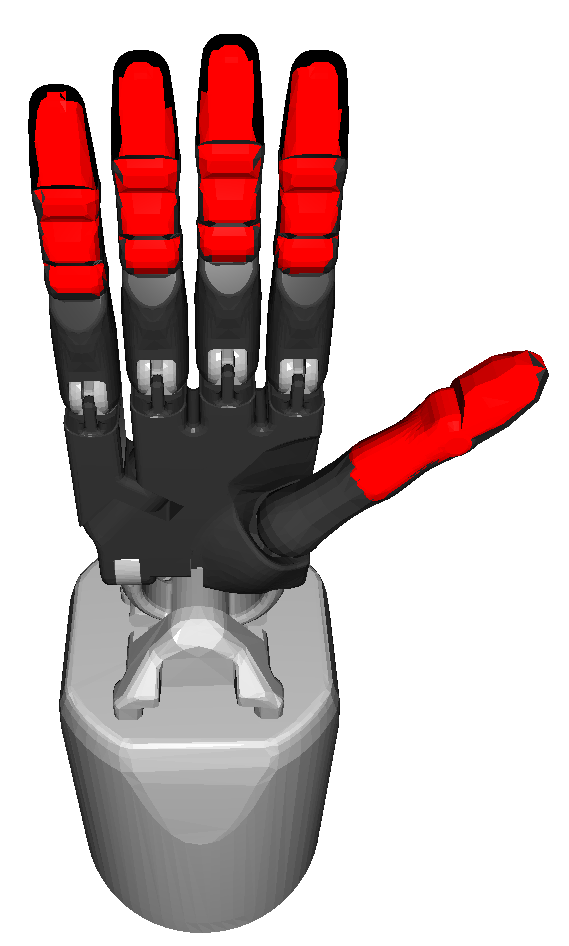

===============================
Contact Surfaces for Evaluation
===============================

To analyze the similarity between the MANO mesh and robotic target systems,
we computed the distances between the contact surfaces of the MANO mesh and
the robotic hands. These are marked in red.

MANO
----

.. image:: _static/contact_surfaces/mano.png
    :width: 40%
    :align: center

Prensilia Mia Hand
------------------

Shadow Dexterous Hand
---------------------

Robotiq 2F-140
--------------

.. image:: _static/contact_surfaces/robotiq.png
    :width: 50%
    :align: center

Barrett Hand
------------

.. image:: _static/contact_surfaces/barrett.png
    :width: 15%
    :align: center
