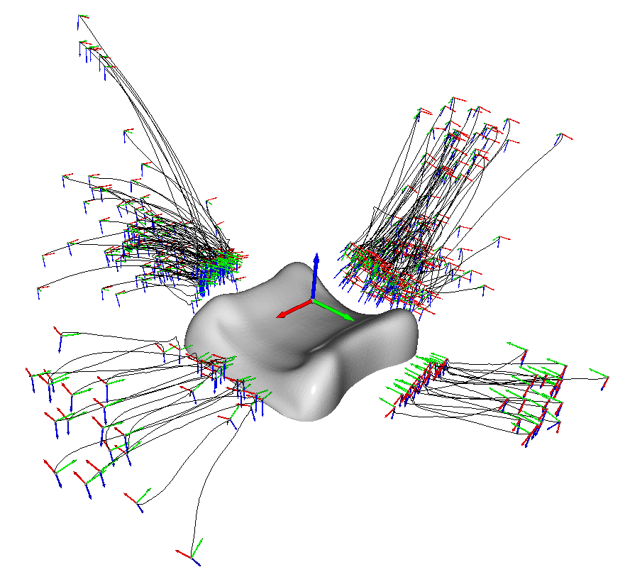

==========
Embodiment
==========

.. contents:: :local:
    :depth: 2

Visualizations
--------------

There are several scripts that visualize aspects of the record and embodiment
mapping.

Record Mapping
^^^^^^^^^^^^^^

.. image:: _static/script_vis_record_mapping.png

Script: ``bin/vis_markers_to_mano_trajectory.py``

Example calls:

.. code-block:: bash

    python bin/vis_markers_to_mano_trajectory.py --demo-file data/Qualisys_pnp/20151005_r_AV82_PickAndPlace_BesMan_labeled_02.tsv --mocap-config examples/config/markers/20151005_besman.yaml --mano-config examples/config/mano/20151005_besman.yaml
    python bin/vis_markers_to_mano_trajectory.py --demo-file data/QualisysAprilTest/april_test_005.tsv
    python bin/vis_markers_to_mano_trajectory.py --demo-file data/20210610_april/Measurement2.tsv --mocap-config examples/config/markers/20210610_april.yaml --mano-config examples/config/mano/20210610_april.yaml
    python bin/vis_markers_to_mano_trajectory.py --demo-file data/20210616_april/Measurement16.tsv --mocap-config examples/config/markers/20210616_april.yaml --mano-config examples/config/mano/20210610_april.yaml --insole
    python bin/vis_markers_to_mano_trajectory.py --demo-file data/20210701_april/Measurement30.tsv --mocap-config examples/config/markers/20210616_april.yaml --mano-config examples/config/mano/20210610_april.yaml --insole

Record and Embodiment Mapping
^^^^^^^^^^^^^^^^^^^^^^^^^^^^^

.. image:: _static/script_vis_embodiment_mapping.png

Trajectory
""""""""""

Script: ``bin/vis_markers_to_robot.py``

Example calls:

.. code-block:: bash

    python bin/vis_markers_to_robot.py shadow --demo-file test/data/recording.tsv --mocap-config examples/config/markers/20210826_april.yaml --mano-config examples/config/mano/20210610_april.yaml --record-mapping-config examples/config/record_mapping/20211105_april.yaml --pillow --show-mano
    python bin/vis_markers_to_robot.py mia --demo-file test/data/recording.tsv --mocap-config examples/config/markers/20210826_april.yaml --mano-config examples/config/mano/20210610_april.yaml --record-mapping-config examples/config/record_mapping/20211105_april.yaml --pillow --mia-thumb-adducted --show-mano
    python bin/vis_markers_to_robot.py mia --demo-file data/Qualisys_pnp/20151005_r_AV82_PickAndPlace_BesMan_labeled_02.tsv --mocap-config examples/config/markers/20151005_besman.yaml --mano-config examples/config/mano/20151005_besman.yaml
    python bin/vis_markers_to_robot.py mia --demo-file data/QualisysAprilTest/april_test_005.tsv
    python bin/vis_markers_to_robot.py mia --demo-file data/20210610_april/Measurement2.tsv --mocap-config examples/config/markers/20210610_april.yaml --mano-config examples/config/mano/20210610_april.yaml --mia-thumb-adducted
    python bin/vis_markers_to_robot.py mia --mocap-config examples/config/markers/20210616_april.yaml --mano-config examples/config/mano/20210616_april.yaml --show-mano --demo-file data/20210616_april/Measurement24.tsv --mia-thumb-adducted
    python bin/vis_markers_to_robot.py mia --mocap-config examples/config/markers/20210616_april.yaml --mano-config examples/config/mano/20210616_april.yaml --demo-file data/20210701_april/Measurement30.tsv --insole --mia-thumb-adducted
    python bin/vis_markers_to_robot.py mia --mocap-config examples/config/markers/20210819_april.yaml --mano-config examples/config/mano/20210616_april.yaml --demo-file data/20210819_april/20210819_r_WK37_insole_set0.tsv --insole --show-mano --mia-thumb-adducted
    python bin/vis_markers_to_robot.py shadow --mocap-config examples/config/markers/20211105_april.yaml --mano-config examples/config/mano/20210616_april.yaml --demo-file data/20210819_april/20210819_r_WK37_insole_set0.tsv --insole --show-mano
    python bin/vis_markers_to_robot.py mia --mocap-config examples/config/markers/20210826_april.yaml --mano-config examples/config/mano/20210610_april.yaml --demo-file data/20210826_april/20210826_r_WK37_small_pillow_set0.tsv --record-mapping-config examples/config/record_mapping/20211105_april.yaml --show-mano --mia-thumb-adducted --pillow
    python bin/vis_markers_to_robot.py shadow --mocap-config examples/config/markers/20211105_april.yaml --mano-config examples/config/mano/20210610_april.yaml --record-mapping-config examples/config/record_mapping/20211105_april.yaml --demo-file data/20211105_april/20211105_r_WK37_electronic_set0.tsv --show-mano --electronic
    python bin/vis_markers_to_robot.py shadow --mocap-config examples/config/markers/20211112_april.yaml --mano-config examples/config/mano/20210610_april.yaml --record-mapping-config examples/config/record_mapping/20211105_april.yaml --demo-file data/20211112_april/20211112_r_WK37_passport_set0.tsv --show-mano --passport

Segment
"""""""

Script: ``bin/vis_segment_markers_to_robot.py``

Example calls:

.. code-block:: bash

    python bin/vis_segment_markers_to_robot.py mia close --mocap-config examples/config/markers/20210616_april.yaml --mano-config examples/config/mano/20210616_april.yaml --demo-file data/20210616_april/metadata/Measurement24.json --segment 0
    python bin/vis_segment_markers_to_robot.py mia close --mocap-config examples/config/markers/20210616_april.yaml --mano-config examples/config/mano/20210701_april.yaml --mia-thumb-adducted --demo-file data/20210701_april/Measurement30.json --segment 0 --insole
    python bin/vis_segment_markers_to_robot.py mia close --mocap-config examples/config/markers/20210819_april.yaml --mano-config examples/config/mano/20210701_april.yaml --mia-thumb-adducted --demo-file data/20210819_april/20210819_r_WK37_insole_set0.json --segment 0 --insole
    python bin/vis_segment_markers_to_robot.py mia close --mocap-config examples/config/markers/20210826_april.yaml --mano-config examples/config/mano/20210701_april.yaml --mia-thumb-adducted --demo-file data/20210826_april/20210826_r_WK37_small_pillow_set0.json --segment 0 --pillow
    python bin/vis_segment_markers_to_robot.py shadow flip --mocap-config examples/config/markers/20211112_april.yaml --mano-config examples/config/mano/20211105_april.yaml --demo-file data/20211112_april/20211112_r_WK37_passport_set0.json --passport --show-mano --segment 0
    python bin/vis_segment_markers_to_robot.py mia close --mocap-config examples/config/markers/20211119_april.yaml --mano-config examples/config/mano/20211105_april.yaml --mia-thumb-adducted --demo-file data/20211119_april/20211119_r_WK37_insole_set0.json --segment 0 --insole
    python bin/vis_segment_markers_to_robot.py mia insert --mocap-config examples/config/markers/20211217_april.yaml --mano-config examples/config/mano/20211105_april.yaml --mia-thumb-adducted --show-mano --demo-file data/20211217_april/20211217_r_WK37_passport_box_set0.json --segment 0 --passport-closed
    python bin/vis_segment_markers_to_robot.py mia close --mocap-config examples/config/markers/20220328_april.yaml --mano-config examples/config/mano/20211105_april.yaml --show-mano --demo-file data/20220328_april/20220328_r_WK37_insole_lateral_front_set0.json --segment 0 --insole
    python bin/vis_segment_markers_to_robot.py mia close --mocap-config examples/config/markers/20220328_april.yaml --mano-config examples/config/mano/20211105_april.yaml --show-mano --demo-file data/20220328_april/20220328_r_WK37_insole_pinch_front_set0.json --segment 0 --insole --mia-thumb-adducted

File Conversion
---------------

In order to convert a motion capture file to a trajectory that can be
executed by a robotic hand, you have to run the script
``bin/convert_hand_trajectory.py``. All scripts can be executed with the
option ``-h`` to see available options.

Visualize Converted Files
^^^^^^^^^^^^^^^^^^^^^^^^^

The script produces CSV files. You can visualize resulting trajectories
with ``bin/vis_embodied_trajectories.py``. Here are two examples of
visualizations created with this script:

.. image:: _static/figure_dataset_grasp_insole.png

